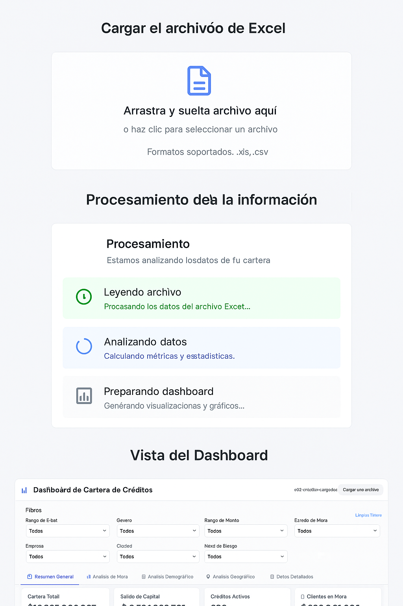
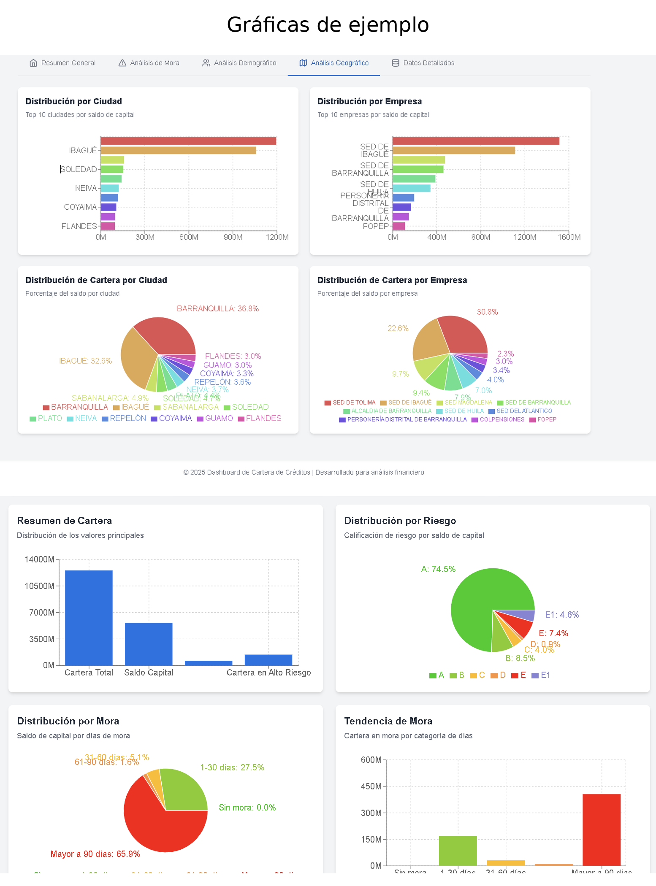

# 📊 CreditDashboards

¡Bienvenido a **CreditDashboards**! Un dashboard interactivo y visual para el análisis de cartera crediticia, diseñado para ofrecerte insights claros y accionables sobre tu portafolio de créditos.

<p align="center">
  
</p>

---

## 🚀 Características principales

- Visualización de KPIs clave de cartera
- Gráficas interactivas por ciudad, empresa, riesgo, mora, edad, género y monto
- Filtros y segmentación de datos
- Interfaz moderna, responsiva y animada
- Fácil integración y personalización

---

## 🖥️ Vista previa

<p align="center">
  
</p>

---

## ⚙️ Instalación

1. **Clona el repositorio:**
   ```bash
   git clone https://github.com/tuusuario/CreditDashboards.git
   cd CreditDashboards
   ```
2. **Instala las dependencias:**
   ```bash
   npm install
   # o
   yarn install
   ```
3. **Configura tus datos:**
   - Coloca tu archivo de datos en la carpeta `/data` o configura la fuente de datos según tu necesidad.

4. **Inicia la aplicación:**
   ```bash
   npm start
   # o
   yarn start
   ```

La aplicación estará disponible en [http://localhost:5173](http://localhost:5173)

---

## 📝 Uso

- Navega por los diferentes paneles para analizar la cartera por ciudad, empresa, riesgo, mora, edad, género y monto.
- Haz hover sobre las gráficas para ver detalles y porcentajes.
- Utiliza los filtros para segmentar la información según tus necesidades.

---

## 📂 Estructura del proyecto

```
CreditDashboards/
├── src/
│   ├── components/         # Componentes principales de React
│   ├── utils/              # Utilidades y cálculos
│   ├── types/              # Definición de tipos y modelos
│   └── ...
├── public/
│   └── ...
├── package.json
└── README.md
```

---

## 🛠️ Tecnologías utilizadas

- [React](https://reactjs.org/) ⚛️
- [TypeScript](https://www.typescriptlang.org/) 🟦
- [Recharts](https://recharts.org/) 📈
- [Tailwind CSS](https://tailwindcss.com/) 💨
- [Vite](https://vitejs.dev/) ⚡

---

## 📸 Ejemplo de gráficas

<p align="center">
  
</p>

---

## 🤝 Contribuciones

¡Las contribuciones son bienvenidas! Si tienes ideas, mejoras o encuentras bugs, por favor abre un issue o un pull request.

---

## 📧 Contacto

¿Tienes dudas o sugerencias? Escríbeme a [agarciagaray@pm.me](mailto:agarciagaray@pm.me)

---

<p align="center">
  <b>Hecho con ❤️ para la gestión inteligente de cartera</b>
</p> 
